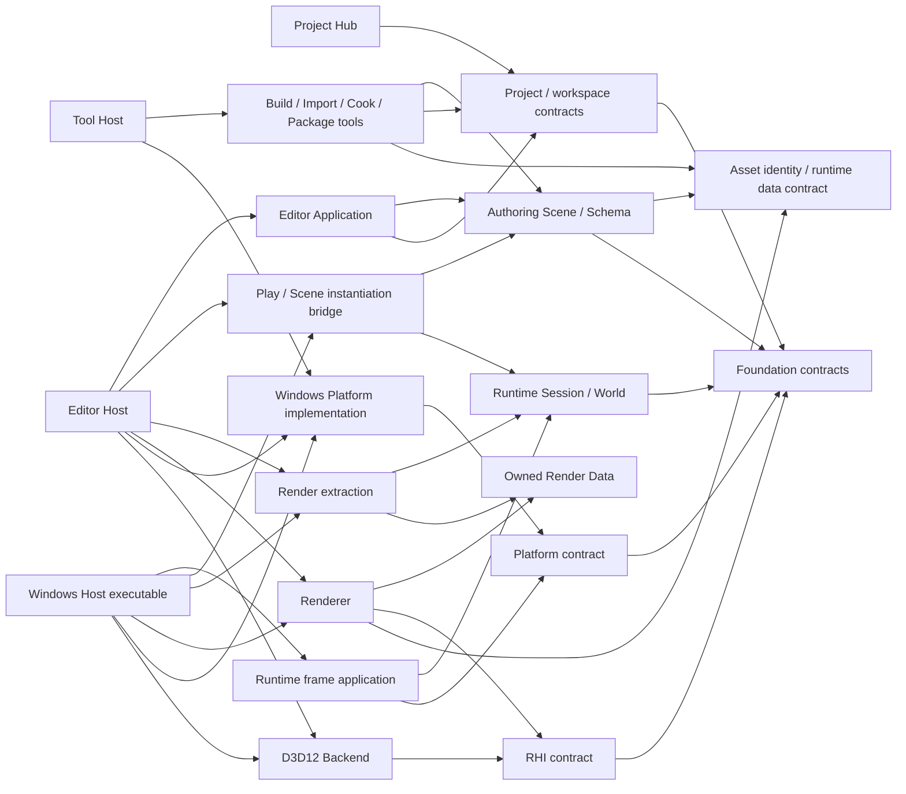

# ADR-0001: 初期Architectureの境界と依存方向

- Status: Accepted（M00-02の設計原則。機能実装とTarget分割は後続Issue）
- Date: 2026-09-24
- Issue: [M00-02 Architecture境界と依存方向を決定する](https://github.com/tochouseito/CueEngine/issues/2)

## Context

新CueEngineは、EditorでProjectを開いてSceneを編集し、Build、Package、Runtime実行まで進める制作経路を先に成立させる。Runtimeは将来の複数Platformを想定する一方、初期HostはWindows、Graphics APIはDirectX 12、Editor UIはImGuiとする。機能到達基準を旧Class構成で代用すると、Editor状態、保存Data、実行状態、GPU Resourceの所有者が再び混ざる。

このADRは初期実装が守る論理境界を決める。Build定義とTarget分割の正本はIssue #3、命名とFile配置の規約はIssue #4で決めるため、以下の箱を直ちに同名のLibraryとして作ることは要求しない。[Issue #1のFeature Parity Matrix](https://github.com/tochouseito/CueEngine/blob/4978bc984bf23bccab5a331b9a730e013d39c51d/Docs/Research/M00-01-Legacy-Feature-Parity-Matrix.md)を機能到達基準として照合した。

参照したLegacyは[`CueEngineLegacy`の`Rebuild`、`f63884f`](https://github.com/tochouseito/CueEngineLegacy/tree/f63884f658efc543855cd80045f734003bc610be)である。Legacyの[Module境界](https://github.com/tochouseito/CueEngineLegacy/blob/f63884f658efc543855cd80045f734003bc610be/Docs/Decisions/0004-runtime-foundation-module-boundaries.md)、[Project／Asset Identity](https://github.com/tochouseito/CueEngineLegacy/blob/f63884f658efc543855cd80045f734003bc610be/Docs/Decisions/0013-project-descriptor-workspace-identity-contract.md)、[Scene永続化](https://github.com/tochouseito/CueEngineLegacy/blob/f63884f658efc543855cd80045f734003bc610be/Docs/Decisions/0017-authoring-scene-runtime-persistence-contract.md)、[Editor Document](https://github.com/tochouseito/CueEngineLegacy/blob/f63884f658efc543855cd80045f734003bc610be/Docs/Decisions/0018-editor-document-command-tool-ui-contract.md)、[Runtime Session](https://github.com/tochouseito/CueEngineLegacy/blob/f63884f658efc543855cd80045f734003bc610be/Docs/Decisions/0021-runtime-application-service-lifetime-play-session-contract.md)、[Game Module ABI](https://github.com/tochouseito/CueEngineLegacy/blob/f63884f658efc543855cd80045f734003bc610be/Docs/Decisions/0022-game-module-project-build-abi-contract.md)、[Render Data](https://github.com/tochouseito/CueEngineLegacy/blob/f63884f658efc543855cd80045f734003bc610be/Docs/Decisions/0027-camera-render-data-and-editor-view-boundaries.md)、[Built-in Asset](https://github.com/tochouseito/CueEngineLegacy/blob/f63884f658efc543855cd80045f734003bc610be/Docs/Decisions/0031-built-in-asset-catalog-runtime-inclusion-contract.md)を設計上の基準とする。

### Feature Parity Matrixとの照合

| Matrixの機能領域 | このADRで固定する境界 | 後続Issueで検証する到達基準 |
| --- | --- | --- |
| Project生成・Hub・再オープン | Project DescriptorとWorkspaceの正本をProject側に置き、HubとEditorは利用者とする | Project IDの維持、別プロセスEditor起動、3構成の生成物 |
| Scene保存・復旧、Hierarchy・Undo/Redo、Project Files | Authoring Sceneは永続Data、Editor Documentは選択・Command・Dirty状態を所有する。File操作はProject Root内で検証する | Save失敗時の旧正本保全、Stable ID、操作のUndo/Redo、Root外拒否と復旧 |
| Editor Play・Input・Game View | Authoring SceneからRuntime Sessionへ一方向に実体化する。Hostが入力と表示を接続する | Play/Stop後のAuthoring状態、Input focus、Game/Debug View |
| Build・Game Module・Package | Build artifactとC ABIの互換性を検証し、ToolsがPackageを作り各Platform Hostが読み込む | 3構成、取消と失敗後の再試行、Build→Package→Run、Dynamic/Monolithic |
| Runtime Scene・Graphics | Runtime Worldから所有値のRender Dataを抽出し、BackendがGPU Resourceを所有する | Legacy M24のCamera/Cube pixelを初期描画基準とし、生成Shipping productのE2Eを追加する。一般Mesh/Material等は別要件 |
| M19とM25～M28 | Built-in AssetはAccepted ADRの契約と未完了実装を分ける。Script、Thread、Job、Project Assetは初期制約だけ固定する | M19 #386～#388と各Research Issueの決定・実装Gateを別に設ける |

この照合は設計の対応付けであり、Matrixの各機能が新Repositoryに実装済みであるという判定ではない。

## Decision

### Legacyからの継承方針

LegacyのAccepted ADRで定義済みの境界、依存方向、永続Identity、所有権、失敗時の保全契約を新CueEngineの初期値として採用する。実装、Module名、Target構成もLegacyを出発点とし、変更が必要な場合だけ理由、影響、代替案、検証方法を後続IssueまたはADRに記録する。Legacyの未完了Researchと実装未完了の機能は、Accepted ADRと混同しない。

この方針は旧Class構成の機械的な再現を要求しない。新Repositoryで実際の利用経路と依存関係を確認してから、必要な単位で実装する。

### 1. 保存、編集、実行の正本

| 領域 | 所有するもの | 所有しないもの |
| --- | --- | --- |
| Authoring Scene | 保存可能なScene Object、Component Data、階層、Stable ID、Schema Version | 選択状態、Undo履歴、Runtime Entity、GPU Resource |
| Editor Document | 開いているAuthoring Scene、選択、Dirty判定、Command履歴、Recoveryと保存先の状態 | Runtime Worldの実体、GPU Resource |
| Runtime Session | Input／TimeのFrame Snapshot、System状態、Runtime World、Scene Instanceの寿命 | MutableなEditor Document、Scene File、ImGui状態 |
| Runtime World | Session内のEntityとComponent、更新時の構造変更 | 永続Object IDの正本、Project File |
| Asset Identity／Runtime Data | Built-in Assetの型付きID、SourceとCook済みRuntime表現を分ける契約。一般Project Asset IDの形式はM28で決める | Scene Pathを恒久Identityとすること、GPU Resourceの所有 |
| Renderer Backend／Presentation | GPU Resource、Descriptor、Fence、Frame Resource | Authoring Source、Asset IDの正本 |

- Scene FileはAuthoring Sceneの永続形式とする。Format Version、Migration条件、未知Dataの扱いを保存契約に含める。正確なWire Formatは後続Issueで決める。
- Editor PlayはAuthoring Sceneから所有値だけのSnapshotを作り、検証後にRuntime Worldへ一方向で実体化する。実体化に失敗した場合は部分生成物を公開せずRollbackする。
- 永続Object IDとRuntime Entity Handleは別物とする。両者の対応はScene InstanceのSession内だけに保持し、Scene Fileへ保存しない。Runtime中の変更をSceneへ暗黙に書き戻さない。
- ProjectとSceneの永続参照はStable IDを使う。PathはLocatorでありIdentityではない。Source Asset、Cook済みRuntime Asset、Cache、Package Payloadを区別する。Built-in AssetはLegacyの`cue://engine/`予約Namespaceを初期値とする。一般Project AssetのID形式、Database、Import/CookはM28のResearchで決め、未実装機能の存在を仮定しない。
- 保存とPackage公開は、検証済み内容を新しい正本へ切り替える境界を明示する。公開前の失敗で旧正本を保持し、公開後のDurabilityが不明な失敗は通常の失敗と区別する。詳細手順は永続化Issueで決める。

### 2. Moduleの依存方向

矢印は「左が右を利用する」を意味する。実装Targetの粒度はIssue #3で決める。

- Runtime、Authoring Scene、Project、Asset Identity、Foundationの公開契約はEditor、ImGui、Win32、D3D12へ依存しない。
- Project HubはProject DescriptorとGeneratorを利用し、Editor起動の選択を行う。SceneやRuntime Worldの所有者にはならない。
- WindowsとD3D12の具体型は各実装と最終ExecutableのComposition Rootへ閉じ込める。Hostが実装を選んで所有し、下位ModuleはHostを参照しない。
- Editor UIはIntentをEditor Applicationへ渡す。UIからScene Serializer、Filesystem、Runtime Worldを直接変更しない。Headless TestとAutomationも同じApplication操作を利用できるようにする。
- Editor PlayとStandaloneは同じRuntime Session契約を使い、それぞれのHostがInput、Window、Presentation、Package読込みを組み立てる。Runtime SessionはWindowやSwap Chainを所有しない。
- Render抽出はRuntime Worldの読み取り可能な状態から、Frame単位の所有値で構成したRender Dataを作る。RendererはそのDataを受け取り、World／Entity／ComponentへのPointerを保持しない。Runtime WorldはRenderer型を知らない。
- GPU Resource、Descriptor、Fence、Frame Resourceの所有者はRenderer Backend／Presentation側とし、Editor UIは非所有の表示Handleだけを借りる。借用期間とGPU完了条件は描画Issueで定める。
- ToolsはSourceを入力としてRuntime DataやPackageを生成する。RuntimeはToolsへ依存せず、製品実行時にSource Assetを直接読まない。
- 共有Foundationに機能を置く理由は、複数Moduleで使うことだけでは足りない。独立した契約として必要な最小機構に限定する。

### 3. 公開APIの契約

全公開APIにOwner、寿命、呼出Thread、再入可否、失敗後状態を記載する。初期の既定値は次のとおりとする。

| API種別 | 所有権と寿命 | Thread | 失敗時 |
| --- | --- | --- | --- |
| Factory結果 | 成功時に呼出側へ一意所有を移す | 作成・破棄Threadを個別に記載 | 部分生成物を公開しない |
| 借用View／Callback | Ownerが保持し、利用可能期間を明示する | 呼出Threadと解除との競合を個別に記載 | 失効後の利用を許さない |
| Editor操作 | Editor Documentが変更の正本を所有する | 初期はEditor owner thread | Command失敗時に文書Revisionと履歴を進めない |
| Runtime World操作 | Runtime SessionがWorldを一意所有する | 初期はSession update owner thread | 部分実体化をRollbackし、停止可能な状態を維持する |
| Render Data | ProducerがFrameの所有値を作り、Consumerへ明示的に渡す | 可変Worldを越境させない | 無効Dataを描画へ黙って通さず診断する |

Thread-safeと明記しないAPIはThread-safeとみなさない。OwnerのいないGlobalなCurrent Project／Current World／Current Deviceを公開しない。Object、Entity、Component、Asset、Serviceを共通の万能基底型へ統合しない。失敗を例外的なLogだけで表さず、呼出側が分岐できるResultと診断情報を返す。

### 4. Game Module境界

- 開発時のDynamic Game Moduleと製品時のMonolithic構成は、Game側の登録意味とRuntime Session契約を共有する。Build／配布方式の詳細は後続ADRで決める。
- Dynamic境界はVersion付きのC互換ABIとHost側Adapterを原則とする。STL型、C++例外、C++ Virtual Interface、Allocator、生Pointerの所有権を境界へ公開しない。
- HostがModuleのLoad／Unloadと互換性検査を所有する。SessionはModuleが提供したFactoryから作る実体を所有する。HostはSession実体を停止・破棄し、Module由来のCallback登録を解除し、実行中Jobの完了または取消を確認し、Function Table参照を失効させてからModuleをUnloadする。
- ABI Version、Configuration、Architecture、Artifactの検査に失敗した場合は登録前に拒否する。関数Tableの項目やScript言語、Reload方式はM25のResearchで決める。

### 5. 将来機能へ残す制約

| 項目 | 今守る契約 | 後続Researchに残す判断 |
| --- | --- | --- |
| M19 Built-in Asset | Legacy ADR-0031の予約Namespace、型付きID、Revision、参照・Package Closure契約を初期値として継承する | 未完了Issueの実装範囲、Payload形式、収録最適化の検証 |
| M25 Scripting | Script InstanceはSessionに属し、Editor Documentを直接変更しない。Dynamic ABIはVersion付き | 言語、公開操作、Serialization、Reload時のState移行、Error Isolation |
| M26 Frame Scheduling | Input、Scene Mutation、Render抽出、GPU Submitに明示的なStage境界を設ける | Thread分割、Frame overlap数、Pacing、停止順の実装 |
| M27 Job System | TaskはOwnerと完了・取消・失敗伝達を持ち、World変更はSafe Pointへ集約する | 並列化Workload、Scheduler、Worker数、Affinity、Profiling |
| M28 Asset Pipeline | SourceとRuntime Dataを分け、Pathを恒久Identityにしない。Built-in AssetとProject Assetを区別する | Project Asset ID形式、Database、Importer、Cooker、Cache、Incremental Build、Bundle Format |

## Alternatives

| 案 | 判断 | 理由 |
| --- | --- | --- |
| Authoring SceneとRuntime Worldを同じ可変Object Graphにする | 採用しない | 保存、Undo、Play終了、Entity再利用の寿命が混ざる |
| Editor UIがSceneとFilesystemを直接操作する | 採用しない | 操作の検証、Rollback、Headless Testの入口が分散する |
| RendererがRuntime WorldのPointerをFrameを越えて保持する | 採用しない | 更新と描画の寿命・Thread境界を固定できない |
| すべてのSubsystemを一つのEngine Globalへ登録する | 採用しない | Ownerと破棄順が見えず、複数Sessionと失敗Rollbackが難しい |
| 最初から全Platform、全Script、全Job、全Asset形式を実装する | 採用しない | 検証対象がないまま公開契約を固定する |

## Consequences and Validation

この境界により、Editor／Standaloneの制作経路を共通Runtimeへ接続でき、保存DataとGPU ResourceのOwnerを分けられる。一方、Snapshot、Bridge、Host compositionを明示する実装作業が増える。実装は利用経路が現れた段階で追加し、単に図に箱があるという理由で空のModuleを作らない。

Issue #5以降では、少なくとも次を検証する。

1. 依存GraphにRuntime→Editor、Runtime World→Renderer、Portable API→Win32／D3D12の逆依存がない。
2. Scene Save失敗、Play開始途中失敗、Runtime停止失敗で、残る正本とOwnerを説明できる。
3. Scene→Snapshot→World→Render Dataの経路で、Session外へRuntime Pointerが残らない。
4. Dynamic／Monolithicの両構成でGame登録の意味が同じで、Module Unload前にSession実体が消える。
5. Asset IDの移動、欠損、未知Versionを区別でき、RuntimeはSource Assetを直読しない。

## 後続Issueへ渡す項目

- Legacyの各Accepted ADRと新実装の差分をIssueごとに記録する。Legacy側でResearchまたは実装未完了の項目は、継承済みとみなさない。
- Issue #3でBuild定義の正本、Visual Studio／MSBuildの位置づけ、Target粒度と構成を決める。
- Issue #4で公開Header、Docs、Testsの配置とCoding Rulesを決める。
- M19 #386～#388、M24で未実行の生成Shipping product E2E、M25～M28のResearchで定まる実装Gateをそれぞれ独立して追跡する。
